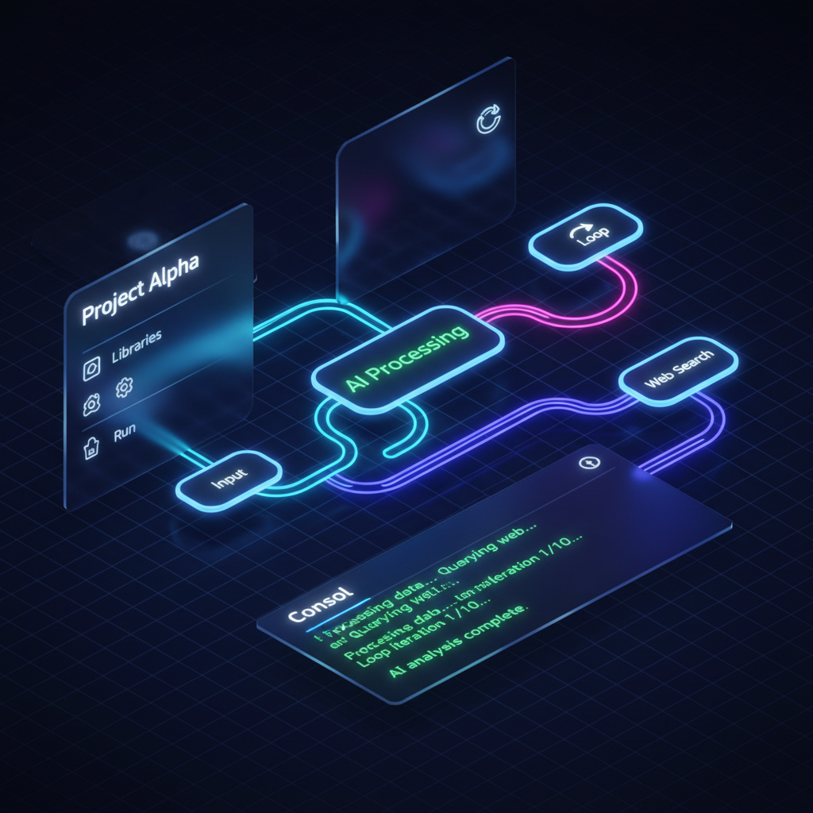

<div align="center">
  

  # 🧠 NeuralCanvas
  ### The Visual AI Orchestration Engine

  **Design complex AI workflows visually. Execute them locally. Empowered by the Cloud.**

  [](https://opensource.org/licenses/MIT)
  [](https://vuejs.org/)
  [](https://fastapi.tiangolo.com/)
  [](https://openrouter.ai/)
</div>

---

## 🚀 Introduction

**NeuralCanvas** is a next-generation visual programming environment designed for building autonomous AI agents and complex workflows without writing a single line of glue code.

It combines the intuitive "drag-and-drop" interface of **Vue Flow** with a powerful Python-based execution engine that supports **Parallel Execution**, **Loops**, **Conditional Logic**, **Advanced Reasoning Patterns**, and **External Tools**.

<div align="center">
  
</div>

---

## ✨ Key Features

### 🎨 Visual Workflow Builder
Create intricate logic chains using a beautiful, infinite canvas. Connect nodes, organize your thoughts, and see the big picture.

### 🤖 Multi-Model AI Support (340+ Models)
Seamlessly integrate **GPT-4**, **Claude 3.5 Sonnet**, **Gemini Pro**, **Llama 3**, **Mistral**, **DeepSeek**, and 340+ other models via **OpenRouter**. Configure temperature and system prompts per node with intelligent model fallback.

### ⚡ Parallel Execution Engine
Execute up to **5 nodes concurrently** with full dependency management. Watch multiple AI agents work simultaneously with real-time streaming visualization.

### 🔄 Logic & Loops (Turing Complete)
Unlike simple linear chat chains, NeuralCanvas supports:
- **Conditional Branching:** IF/ELSE logic based on AI analysis
- **Iterative Loops:** Refine outputs by cycling through nodes with target-based exit conditions
- **Dynamic Routing:** Multi-path execution with conditional splits

### 🧩 Advanced Reasoning Patterns
Industry-leading AI reasoning techniques built-in:

#### 📄 **MapReduce Pattern**
- Split large documents into chunks (fixed-size or semantic)
- Process chunks in parallel with LLM summarization
- Hierarchical reduction for unlimited context handling

#### 🎲 **Self-Consistency**
- Generate multiple reasoning paths with varying temperatures
- Vote on final answer (majority, longest, first)
- Reduce hallucinations by 15-25% compared to single-shot

#### 🎭 **Mixture of Agents (MoA)**
- Parallel proposals from diverse models (GPT-4, Claude, Gemini)
- Synthesis layer aggregates perspectives
- 7.6% quality improvement over single-model approaches

#### ⚔️ **Debate Pattern**
- Multi-round AI debates with Pro/Con/Neutral positions
- GPT-4 judge evaluates arguments and delivers verdict
- Ideal for fact-checking and complex decision-making

### 🌍 Web Search & Tools
Give your AI agents access to the real world. The built-in **Web Search Node** (powered by DuckDuckGo) fetches live information for context-aware generation.

### 💾 Save, Load & Templates (11 Built-in)
- **Persistence:** Save your masterpieces to local storage
- **Templates:** Start fast with production-ready templates:
  - 🗞️ The Tech Journalist (Research + Article)
  - 💡 The Idea Refiner (Iterative Loop)
  - 🔀 The Support Router (Sentiment Routing)
  - 👔 The Executive Board (Parallel Specialists)
  - 🤖 The Auto-Manager (Dynamic Agent Assignment)
  - 💻 The Iterative Coder (Code Review Loop)
  - ⚡ Parallel Speed Test (5 Concurrent LLMs)
  - 💎 The Diamond Pattern (Dependency Test)
  - 🔬 The Research Team (Parallel Research + Synthesis)
  - 🛡️ Fallback System Test (Auto-Recovery)
  - 📄 Document Analyzer (MapReduce)
  - 🎲 The Jury (Self-Consistency)
  - 🎭 The Think Tank (MoA)
  - ⚔️ The Fact Checker (Debate)

### 💸 Real-Time Cost Tracking
Monitor token usage and estimated costs in real-time per node. Never get surprised by an API bill again.

### 🔄 Intelligent Model Fallback
Primary model unavailable? NeuralCanvas automatically falls back to alternative models with seamless recovery.

---

## 🧱 Available Node Types (13)

| Node | Type | Description |
|------|------|-------------|
| 📥 | **Input** | Static text or dynamic user input |
| 🧠 | **LLM** | AI processing with 340+ models |
| 📤 | **Output** | Final result display |
| 🔀 | **Condition** | IF/ELSE branching logic |
| 🔁 | **Loop** | Iterative refinement with exit conditions |
| 🔍 | **Web Search** | Live DuckDuckGo search integration |
| ✂️ | **Splitter** | Document chunking (fixed/semantic) |
| 🔄 | **Reducer** | Hierarchical LLM reduction |
| 🎲 | **Self-Consistency** | Multi-sample voting |
| 🎭 | **MoA Proposer** | Multi-model parallel proposals |
| 🎯 | **MoA Aggregator** | Perspective synthesis |
| ⚔️ | **Debate Arena** | Multi-round AI debates |
| 🗳️ | **Judge & Voting** | Evaluation and consensus |

---

## 🛠️ Tech Stack

*   **Frontend:** Vue 3, Vite, TypeScript, Tailwind CSS (v4), Vue Flow, Pinia
*   **Backend:** Python 3.12, FastAPI, Uvicorn, WebSockets, AsyncIO
*   **AI Engine:** OpenAI SDK (via OpenRouter), Intelligent Fallback System
*   **Search:** DuckDuckGo (primp)
*   **Design:** Custom Cyberpunk/Glassmorphism Theme, Phosphor Icons

---

## ⚡ Quick Start

### Prerequisites
- Python 3.10+
- Node.js 18+
- An [OpenRouter API Key](https://openrouter.ai/)

### 1. Clone the Repository
```bash
git clone https://github.com/BTankut/neuralcanvas.git
cd neuralcanvas
```

### 2. Setup Backend
```bash
cd backend
python3 -m venv venv
source venv/bin/activate  # Windows: venv\Scripts\activate
pip install -r requirements.txt
python3 -m uvicorn app.main:app --reload
```
*Backend runs at `http://localhost:8000`*

### 3. Setup Frontend
Open a new terminal window:
```bash
cd frontend
npm install
npm run dev
```
*Frontend runs at `http://localhost:5173`*

### 4. Launch!
Go to `http://localhost:5173`, click the **Settings (Gear)** icon, and enter your OpenRouter API Key. You are ready to create!

---

## 📖 How to Use

1.  **Add Nodes:** Right-click on the canvas to open the Context Menu
2.  **Connect:** Drag from one node's handle to another to create a data flow
3.  **Configure:** Click on a node to adjust settings (Model, Prompt, Search Query)
4.  **Run:** Click the "RUN FLOW" button in the top right
5.  **Visualize:** Watch the execution flow in real-time with animated edges, streaming text, and status indicators

---

## 🎯 Example Workflows

### Fact-Checking Pipeline
```
Input → Debate Arena (3 debaters, 2 rounds) → Judge & Voting (GPT-4) → Output
```

### Research Report Generator
```
Input → Web Search (parallel) → MoA Proposer (3 models) → MoA Aggregator → Output
```

### Document Analysis
```
Large Text → Splitter (semantic) → Reducer (hierarchical) → Output
```

---

## 🏗️ Architecture

### Parallel Execution Engine
- **DAG-based Scheduler:** Automatic dependency resolution
- **Concurrent Execution:** Up to 5 nodes simultaneously
- **Stream Multiplexing:** Real-time WebSocket updates from parallel nodes
- **Fault Tolerance:** Per-node error handling with global rollback

### Advanced Features
- **Streaming LLM Responses:** Token-by-token updates
- **Model Fallback:** Automatic retry with alternative models
- **Cost Tracking:** Real-time token usage monitoring
- **Template System:** Pre-built workflow patterns
- **Persistence:** LocalStorage-based save/load

---

## 🤝 Contributing

Contributions are welcome! Please feel free to submit a Pull Request.

---

## 📄 License

This project is licensed under the MIT License - see the [LICENSE](LICENSE) file for details.

---

<div align="center">
  <sub>Built with ❤️ by <a href="https://github.com/BTankut">BTankut</a></sub>
</div>
