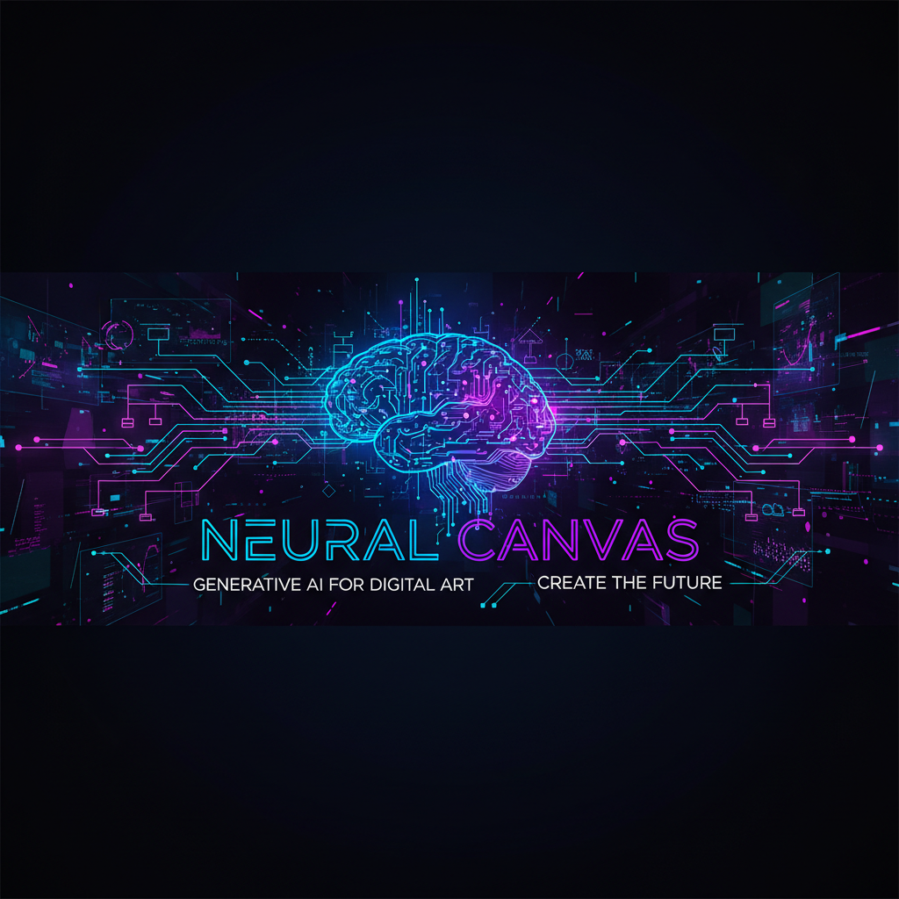
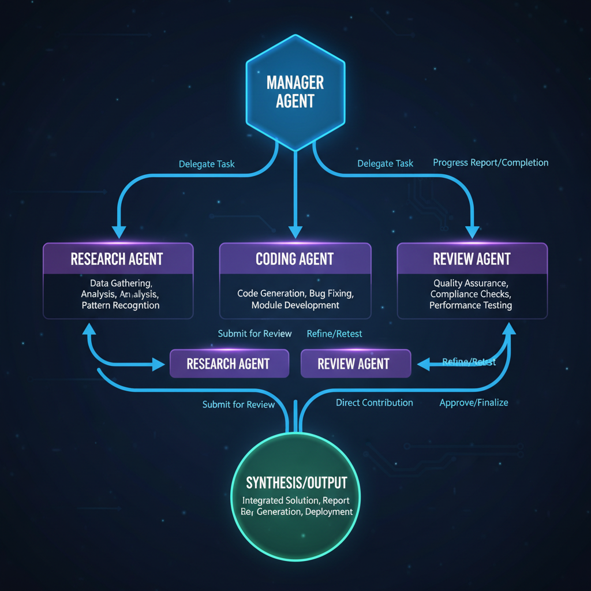
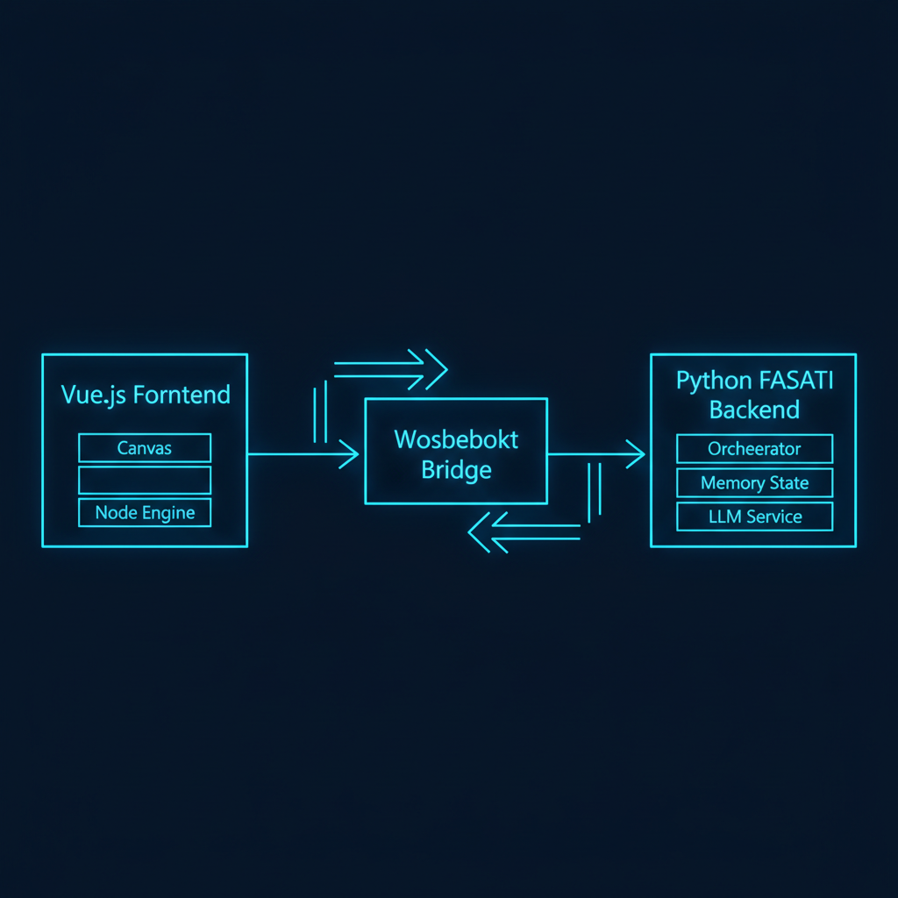

<div align="center">
  

  # NeuralCanvas
  ### Visual AI Orchestration Engine
  
  **Design, execute, and manage complex multi-agent AI workflows visually.**

  [](https://opensource.org/licenses/MIT)
  [](https://vuejs.org/)
  [](https://fastapi.tiangolo.com/)
  [](https://openrouter.ai/)
</div>

---

## Introduction

NeuralCanvas is a production-grade visual programming environment designed for building autonomous AI agents and orchestration pipelines. It eliminates the complexity of writing glue code for LLM chains, allowing developers and researchers to focus on logic and architecture.

Unlike simple linear chat interfaces, NeuralCanvas supports **Turing-complete** constructs including conditional branching, iterative loops, and stateful memory, enabling the creation of truly autonomous systems.

<div align="center">
  
</div>

---

## Core Capabilities

### Visual Workflow Builder
An infinite, interactive canvas built on Vue Flow. Drag and drop nodes, connect them with bezier curves, and organize complex logic visually. The interface is designed for clarity and efficiency in managing large-scale agent networks.

### Advanced Orchestration Patterns
NeuralCanvas goes beyond simple chains. It implements cutting-edge AI architecture patterns out of the box:
*   **Mixture-of-Agents (MoA):** Query multiple models in parallel and synthesize their outputs for superior quality.
*   **Multi-Agent Debate:** Simulate adversarial debates between agents to reduce hallucinations and refine arguments.
*   **Map-Reduce:** Process large documents by splitting them into chunks, processing in parallel, and reducing the results hierarchically.
*   **Self-Consistency:** Improve reasoning reliability by generating multiple distinct paths and voting on the consensus.

<div align="center">
  
</div>

### Stateful Execution Engine
The Python-based backend maintains execution state, chat history, and context for every node.
*   **Smart Loops:** Iterate based on feedback. An agent can critique code, and the loop will continue until the critique is addressed.
*   **Conditional Logic:** Route workflows dynamically based on AI analysis of the content (e.g., Sentiment Analysis routing).
*   **Memory:** Agents remember their role and past interactions within a session.

### Multi-Model Integration
Seamlessly mix and match models within the same workflow via OpenRouter. Use **Advanced Reasoning Models** for complex logic, **Creative Models** for content generation, and **Fast/Lightweight Models** for high-speed tasks.

---

## System Architecture

The system follows a decoupled client-server architecture.

*   **Frontend:** A Vue 3 SPA (Single Page Application) handles the UI, graph state, and user interaction.
*   **Backend:** A FastAPI server manages the execution queue, WebSocket streaming, and LLM API integrations.
*   **Communication:** Real-time bi-directional communication via WebSockets ensures instant feedback and live token streaming.

<div align="center">
  
</div>

---

## Getting Started

### Prerequisites
- Python 3.10+
- Node.js 18+
- An OpenRouter API Key

### Installation

1.  **Clone Repository**
    ```bash
    git clone https://github.com/BTankut/neuralcanvas.git
    cd neuralcanvas
    ```

2.  **Backend Setup**
    ```bash
    cd backend
    python3 -m venv venv
    source venv/bin/activate  # Windows: venv\Scripts\activate
    pip install -r requirements.txt
    python3 -m uvicorn app.main:app --reload
    ```

3.  **Frontend Setup**
    ```bash
    cd frontend
    npm install
    npm run dev
    ```

4.  **Access**
    Open `http://localhost:5173` in your browser. Configure your API Key in the Settings menu.

---

## Usage Templates

NeuralCanvas includes several production-ready templates to demonstrate its capabilities:

*   **The Tech Journalist:** Automated research and article writing pipeline.
*   **The Auto-Manager:** A manager agent dynamically assigns roles to sub-agents based on the task prompt.
*   **The Ultimate Battle:** A comparison benchmark between MoA and Debate architectures.
*   **The Iterative Coder:** A self-correcting coding loop where a Reviewer agent critiques and a Developer agent fixes the code until approval.

---

## Contributing

We welcome contributions to improve NeuralCanvas. Please follow standard GitHub pull request procedures.

---

<div align="center">
  <sub>Built by <a href="https://github.com/BTankut">BTankut</a></sub>
</div>